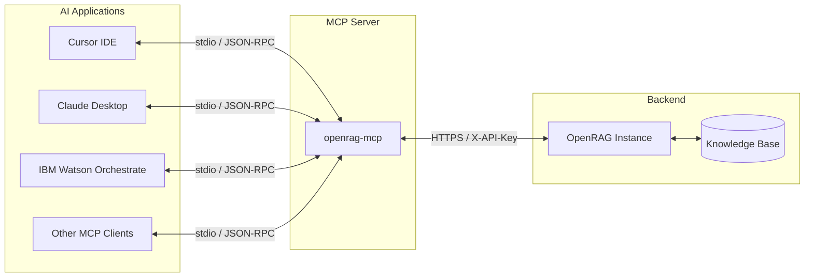

# OpenRAG MCP

OpenRAG MCP is a [Model Context Protocol](https://modelcontextprotocol.io/) server that exposes your OpenRAG knowledge base to AI assistants. It enables seamless integration between OpenRAG's RAG capabilities and MCP-compatible applications like Cursor, Claude Desktop, and IBM Watson Orchestrate.

---

## Quick Start

Run the MCP server using `uvx` (no installation required):

```bash
uvx openrag-mcp
```

For a specific version:

```bash
uvx --from openrag-mcp==0.1.1 openrag-mcp
```

### Prerequisites

- Python 3.10+
- A running OpenRAG instance
- An OpenRAG API key (create one in **Settings > API Keys**)

---

## Environment Variables

| Variable | Description | Required | Default |
|:---------|:------------|:--------:|:--------|
| `OPENRAG_API_KEY` | Your OpenRAG API key | Yes | - |
| `OPENRAG_URL` | URL of your OpenRAG instance | No | `http://localhost:3000` |

---

## Features

| Feature | Tool | Status | Description |
|:--------|:-----|:------:|:------------|
| **Chat** | `openrag_chat` | GA | RAG-enhanced conversations with your knowledge base |
| **Search** | `openrag_search` | WIP | Semantic search over documents with relevance scoring |
| **File Ingestion** | `openrag_ingest_file` | WIP | Ingest local files (PDF, DOCX, TXT, MD, HTML) |
| **URL Ingestion** | `openrag_ingest_url` | WIP | Ingest content from web URLs |
| **Delete Document** | `openrag_delete_document` | WIP | Remove documents from knowledge base |
| **Task Status** | `openrag_get_task_status` | WIP | Check async ingestion task progress |
| **Wait for Task** | `openrag_wait_for_task` | WIP | Poll until ingestion completes |

---

## Use Cases

### Why OpenRAG MCP?

OpenRAG MCP acts as a **universal connectivity layer** between your knowledge base and AI-powered applications. Instead of building custom integrations for each platform, MCP provides a standardized protocol that works everywhere.

**Key Benefits:**

- **Zero Custom Integration** - No need to build platform-specific APIs or plugins. One MCP server works across all compatible applications.

- **Agentic AI Enablement** - Empowers AI agents to autonomously search, retrieve, and reason over your organizational knowledge without human intervention.

- **Future-Proof Architecture** - MCP is an open standard backed by Anthropic and adopted by major AI platforms. Your integration investment carries forward as the ecosystem grows.

- **Centralized Knowledge Access** - Single point of entry to your knowledge base for all AI applications, ensuring consistent answers and reducing knowledge silos.

- **Secure by Design** - API key authentication ensures only authorized applications access your knowledge. No data leaves your infrastructure without explicit permission.

- **Multi-Agent Workflows** - Enable complex workflows where multiple AI agents collaborate using shared knowledge, such as a coding agent consulting documentation while a review agent validates compliance.

- **Reduced Hallucination** - RAG-enhanced responses are grounded in your actual documents, reducing AI hallucinations with verifiable, sourced answers.

- **Enterprise Knowledge Democratization** - Make institutional knowledge accessible to every team member through their preferred AI tool, from developers in Cursor to analysts in Claude.

- **Real-Time Knowledge Sync** - As you ingest new documents into OpenRAG, all connected AI applications immediately gain access to the updated knowledge.

- **Minimal Infrastructure Overhead** - Runs as a lightweight subprocess spawned by the AI application. No separate servers, containers, or complex deployment required.

### Agentic Application Integration

| Platform | Use Case |
|:---------|:---------|
| **Cursor IDE** | Context-aware code assistance powered by your documentation, design specs, and internal wikis |
| **Claude Desktop** | Enhanced conversations that leverage your organization's knowledge base for accurate, sourced answers |
| **IBM Watson Orchestrate** | Workflow automation with RAG capabilities for enterprise knowledge retrieval |
| **Custom MCP Clients** | Build your own integrations using the open MCP protocol |

### Example Scenarios

- **Developer Productivity**: Query internal API docs, architecture decisions, and runbooks directly from your IDE
- **Customer Support**: AI assistants that reference your product documentation and knowledge base
- **Research & Analysis**: Search and synthesize information across multiple document sources
- **Workflow Automation**: Trigger document ingestion and knowledge queries as part of automated pipelines

---

## Platform Configuration

### Cursor IDE

Add to `~/.cursor/mcp.json`:

```json
{
  "mcpServers": {
    "openrag": {
      "command": "uvx",
      "args": ["openrag-mcp"],
      "env": {
        "OPENRAG_URL": "https://your-openrag-instance.com",
        "OPENRAG_API_KEY": "orag_your_api_key_here"
      }
    }
  }
}
```

### Claude Desktop

**macOS**: `~/Library/Application Support/Claude/claude_desktop_config.json`  
**Windows**: `%APPDATA%\Claude\claude_desktop_config.json`

```json
{
  "mcpServers": {
    "openrag": {
      "command": "uvx",
      "args": ["openrag-mcp"],
      "env": {
        "OPENRAG_URL": "https://your-openrag-instance.com",
        "OPENRAG_API_KEY": "orag_your_api_key_here"
      }
    }
  }
}
```

---

## Architecture



---

## Example Prompts

Once configured, interact with OpenRAG through natural language:

- *"Search my knowledge base for authentication best practices"*
- *"What documents do I have about deployment procedures?"*
- *"Chat with OpenRAG about the Q4 roadmap"*
- *"Ingest this PDF: /path/to/architecture-overview.pdf"*
- *"Delete the outdated spec document from my knowledge base"*

---

## Troubleshooting

| Issue | Solution |
|:------|:---------|
| "OPENRAG_API_KEY environment variable is required" | Ensure `OPENRAG_API_KEY` is set in the `env` section of your MCP config |
| "Connection refused" errors | Verify OpenRAG is running and `OPENRAG_URL` is correct |
| Tools not appearing | Restart your AI application after config changes |

---

## Resources

- [OpenRAG Documentation](https://docs.openr.ag)
- [MCP SDK README](sdks/mcp/README.md)
- [Model Context Protocol Specification](https://modelcontextprotocol.io/)

---

## License

Apache 2.0 - See [LICENSE](LICENSE) for details.

