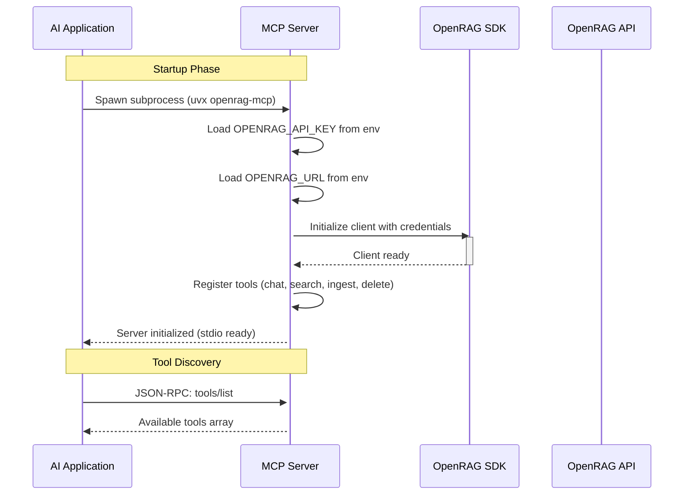
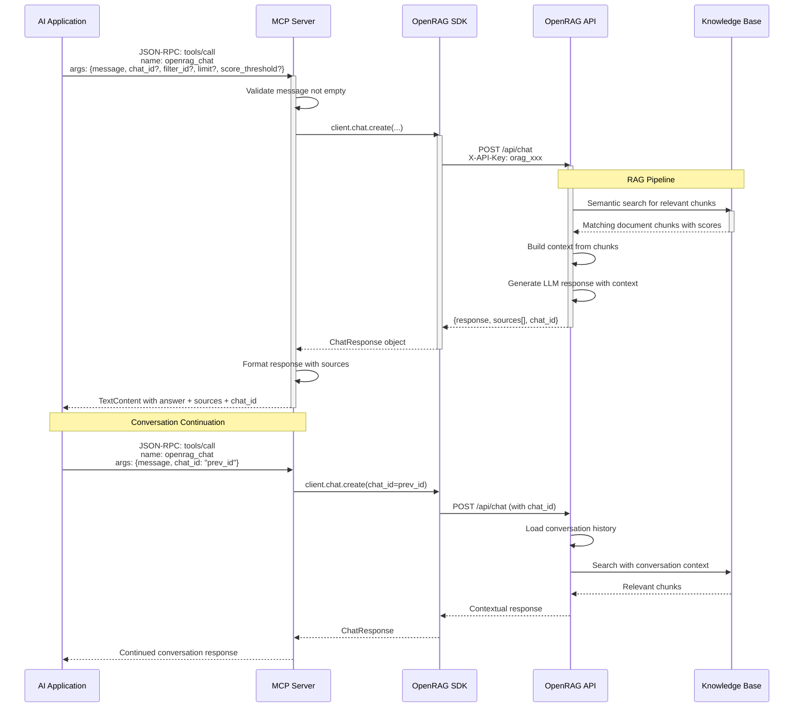
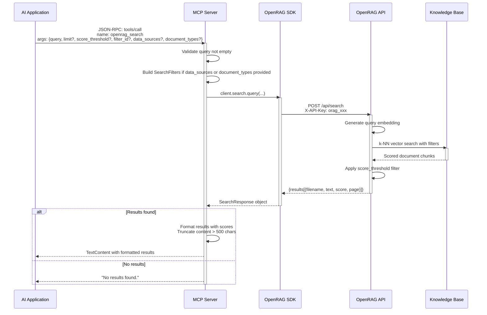
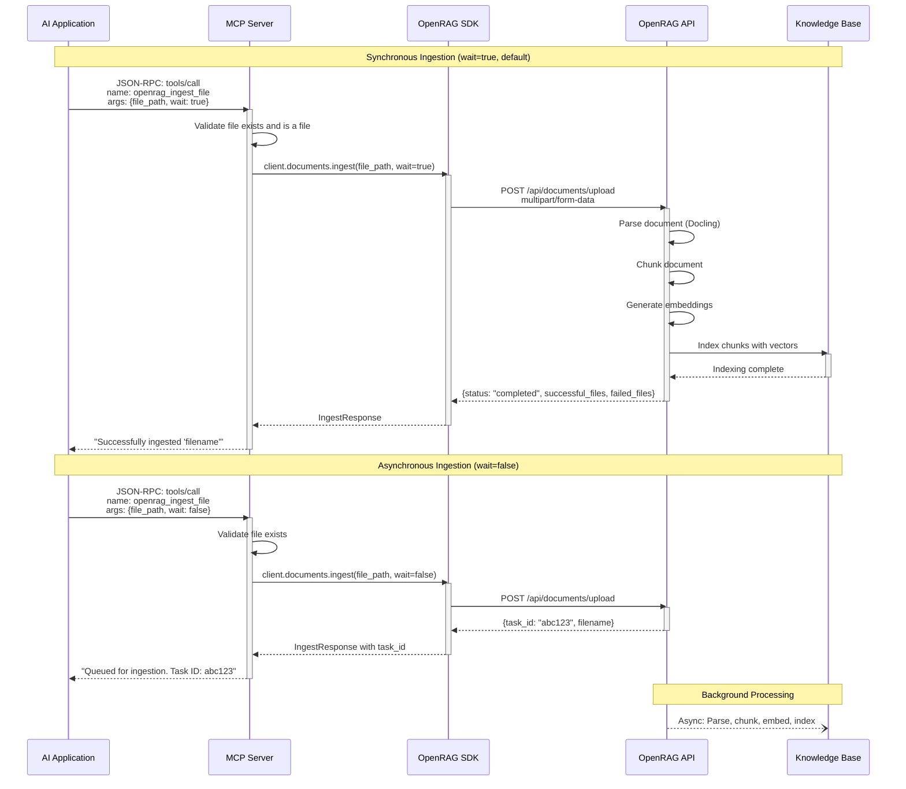
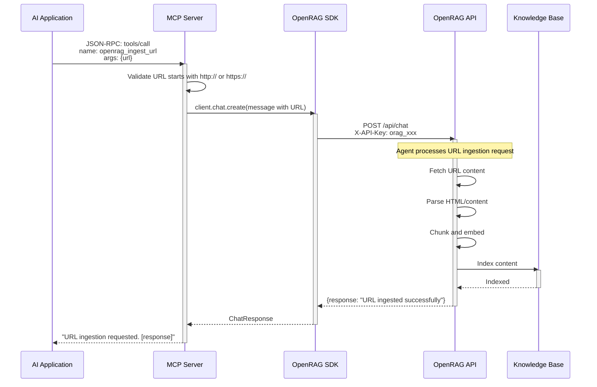
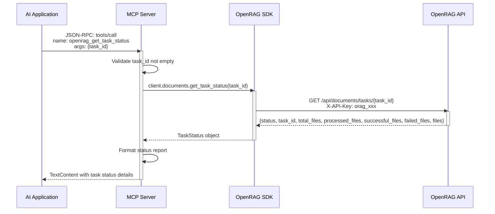
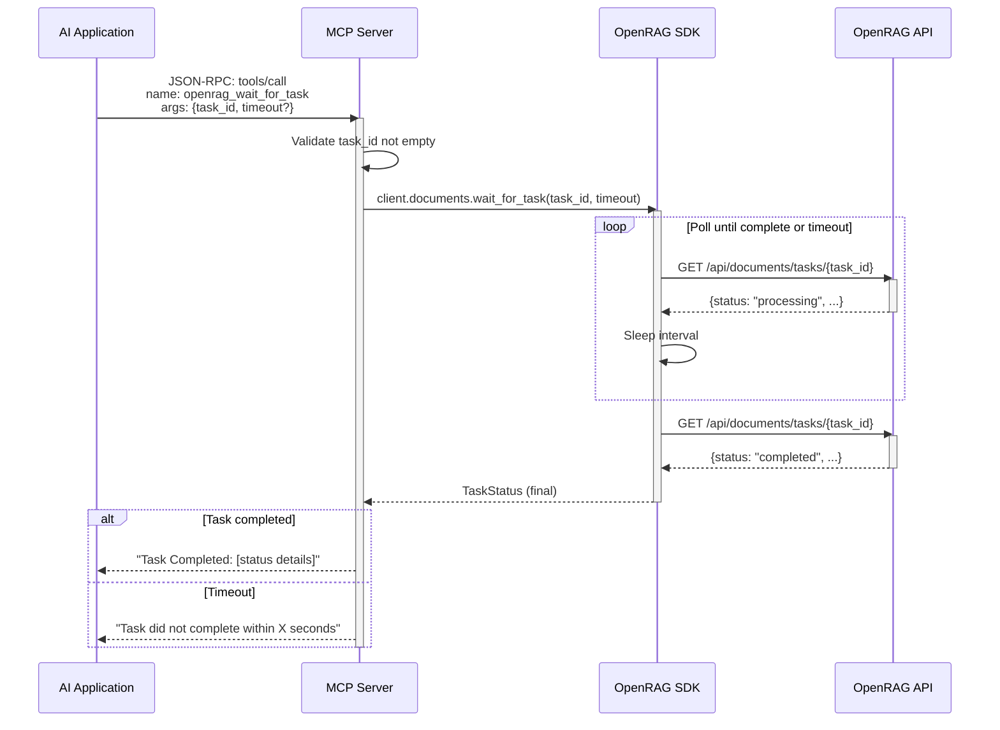
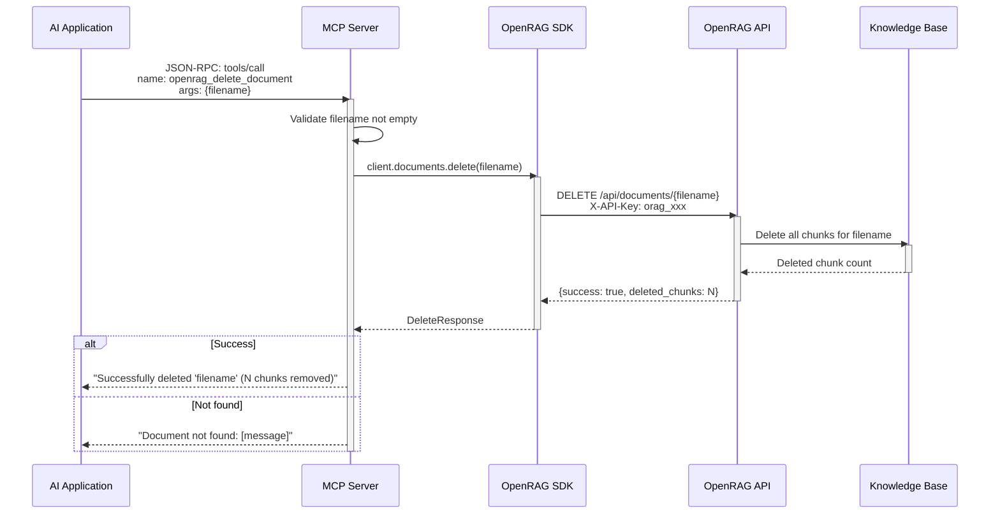
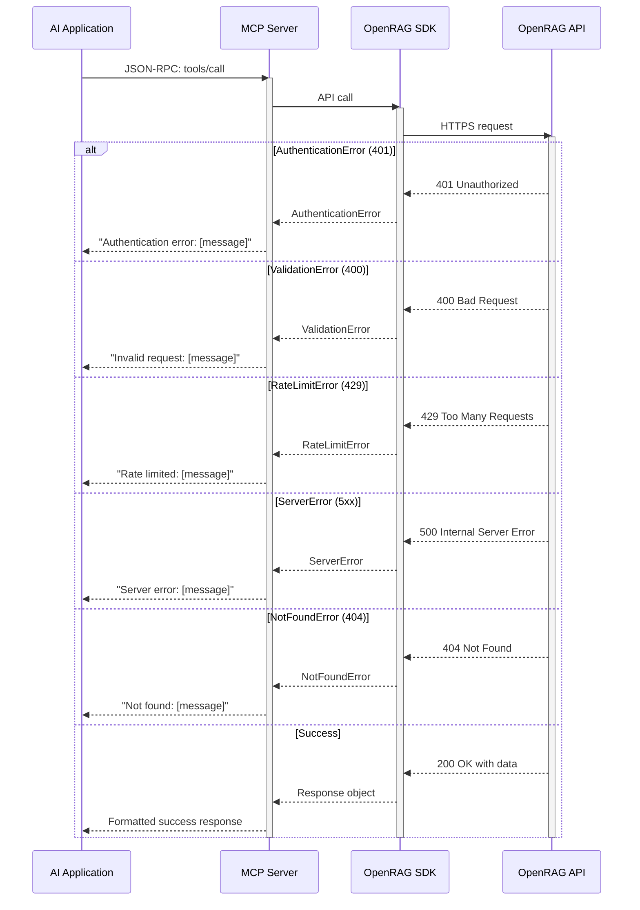
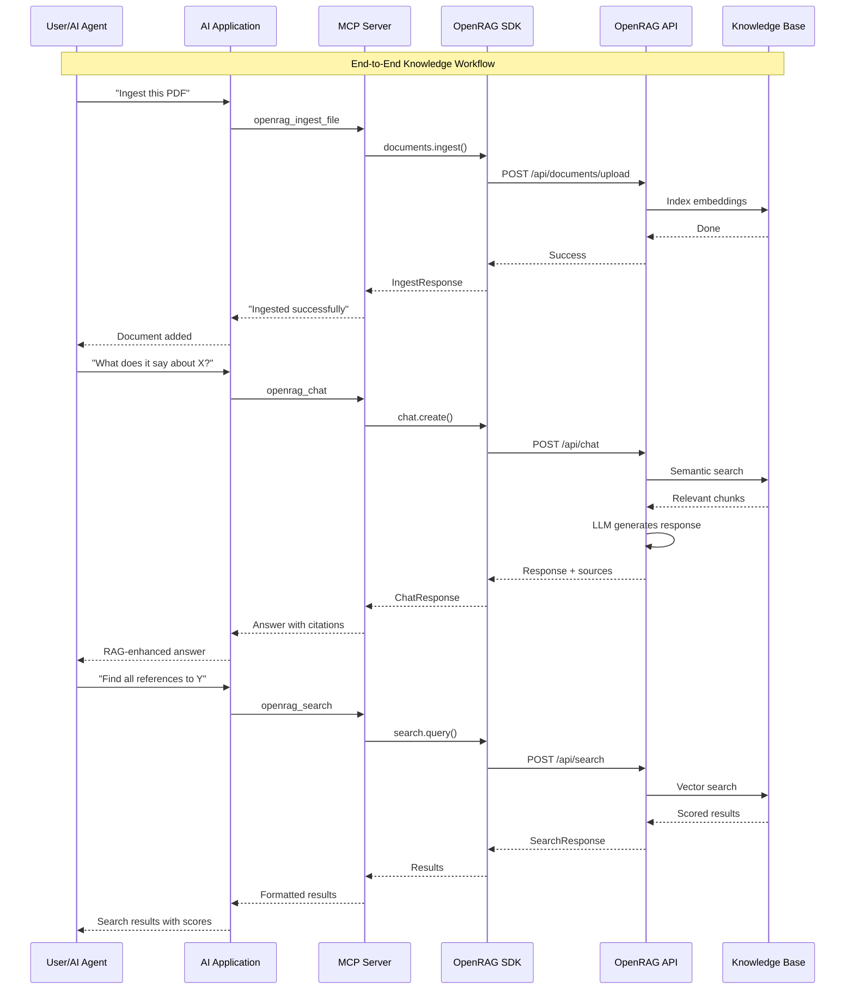

# OpenRAG MCP Sequence Diagrams

This document illustrates the interaction flows between AI applications and OpenRAG through the Model Context Protocol (MCP) server.

## Participants

| Participant | Description |
|:------------|:------------|
| **AI App** | MCP-compatible application (Cursor IDE, Claude Desktop, Watson Orchestrate) |
| **MCP Server** | OpenRAG MCP server (`openrag-mcp`) running as subprocess |
| **OpenRAG SDK** | Python SDK client within MCP server |
| **OpenRAG API** | OpenRAG FastAPI backend server |
| **Knowledge Base** | OpenSearch vector database storing document embeddings |

---

## 1. Server Initialization

---

## 2. Chat Flow (openrag_chat)

RAG-enhanced conversation using the knowledge base.

---

## 3. Search Flow (openrag_search)

Semantic search over the knowledge base.

---

## 4. File Ingestion Flow (openrag_ingest_file)

Ingest local files into the knowledge base with sync or async modes.

---

## 5. URL Ingestion Flow (openrag_ingest_url)

Ingest content from web URLs.

---

## 6. Task Status Flow (openrag_get_task_status)

Check the status of an async ingestion task.

---

## 7. Wait for Task Flow (openrag_wait_for_task)

Poll until an ingestion task completes.

---

## 8. Delete Document Flow (openrag_delete_document)

Remove a document from the knowledge base.

---

## 9. Error Handling

All tools implement consistent error handling.

---

## Complete Architecture Overview

---

## Protocol Details

| Layer | Protocol | Format |
|:------|:---------|:-------|
| AI App ↔ MCP Server | stdio | JSON-RPC 2.0 |
| MCP Server ↔ OpenRAG API | HTTPS | REST + JSON |
| Authentication | Header | `X-API-Key: orag_xxx` |

## Tool Summary

| Tool | Purpose | Key Parameters |
|:-----|:--------|:---------------|
| `openrag_chat` | RAG conversation | message, chat_id, filter_id, limit, score_threshold |
| `openrag_search` | Semantic search | query, limit, score_threshold, filter_id, data_sources, document_types |
| `openrag_ingest_file` | Ingest local file | file_path, wait |
| `openrag_ingest_url` | Ingest from URL | url |
| `openrag_get_task_status` | Check task status | task_id |
| `openrag_wait_for_task` | Wait for completion | task_id, timeout |
| `openrag_delete_document` | Remove document | filename |
